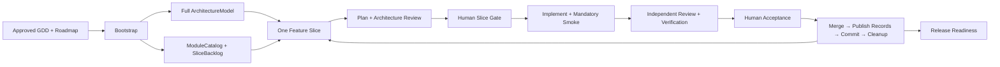

# game-forge

`forge-game` is a Codex skill and deterministic control plane for developing Unreal Engine projects from approved GDD and Roadmap inputs.

It keeps a complete, evolving view of the project architecture while delivering the game through small, gated vertical slices. Human decisions remain explicit; workflow state, approvals, evidence, architecture records, and side effects are machine-verifiable.

> **Status: forward-test candidate (`v0.16.0`).** The local text-slice path is implemented and covered by 129 automated tests. The next release gate is a bounded forward-test on a real small Unreal project. This status does not claim field-proven production readiness.

## Why this exists

Game projects need both a coherent long-term architecture and short feedback loops. Designing only the current task causes architectural drift; designing every future class up front creates speculative detail.

`forge-game` uses a middle path:

- **Full-project architecture:** Bootstrap maps all known systems, modules, contracts, dependencies, runtime flows, and NFRs from the full GDD and Roadmap.
- **Progressive detail:** untouched modules retain stable responsibilities and boundaries; implementation detail deepens only where verified work occurs.
- **Slice-gated delivery:** one Feature run implements exactly one playable or explicitly bounded enabling slice.
- **Non-waivable smoke:** every slice must execute its approved end-to-end scenario before independent review.
- **Atomic project records:** architecture, module catalog, slice backlog, traceability graph, and ProjectState advance as one validated promotion set.



## Workflows

Invoke `$forge-game` with exactly one entrypoint:

| Entrypoint | Purpose | Current package readiness |
| --- | --- | --- |
| **Bootstrap** | Bind approved sources, discover a greenfield or brownfield project, design the full architecture, and install the project-local control layer. | Required executors ready |
| **Feature** | Implement one eligible slice of one feature, identified by stable `feature_id` and `slice_id`. | Local text-slice profile ready; Network, Push, and LFS mutation remain optional and fail-closed |
| **Refresh** | Upgrade forge-game infrastructure or adopt approved source changes without overwriting user-owned files. | Required executors ready |
| **Release** | Evaluate feature completion, evidence, debt, builds, NFRs, and the final release gate. | Required local executors ready; external publishing is outside the baseline |

“Ready” means that every completion-critical action has a registered executable adapter. It does not replace the real-project forward-test or Unreal acceptance run.

## What is included

- Versioned JSON Schemas and workflow definitions.
- Immutable artifacts, approvals, checkpoints, transitions, and recovery journals.
- Full `ArchitectureModel`, `ModuleCatalog`, and `SliceBacklog` contracts.
- Traceability predicates for slice eligibility/completion, feature completion, architecture consistency, and release readiness.
- Ownership-aware project reconciliation that preserves unknown and user-owned files.
- Atomic `ProjectRecordSet` publication with compare-and-swap, rollback, and reconciliation.
- Policy-backed filesystem, local Git, Build/Test, runtime cleanup, and Unreal MCP adapters.
- Hash-pinned engineering rules with typed applicability and compliance evidence.
- Project-local `AGENTS.md`, role skills, Codex hooks, command manifests, and policy gateway templates.
- A typed `forward-test-preflight` for real Unreal projects.

The package currently contains 82 schemas, four workflow definitions, and project-local template set `1.8.0`. Feature workflow version is `2.1.0`.

## Install

Ask Codex to install the skill with `$skill-installer` from:

```text
https://github.com/Elaiv/game-forge/tree/main/forge-game
```

For local development, clone the repository and link the skill directory:

```bash
git clone https://github.com/Elaiv/game-forge.git
cd game-forge
mkdir -p ~/.codex/skills
ln -s "$(pwd)/forge-game" ~/.codex/skills/forge-game
```

Open a new Codex task after installation so the skill is rediscovered.

## Quick start

Bootstrap a project:

```text
Use $forge-game to bootstrap /absolute/path/TinyGame from the approved GDD and Roadmap.
```

Implement one slice after Bootstrap:

```text
Use $forge-game to implement feature FEAT-001, slice SLICE-001, in /absolute/path/TinyGame.
```

The skill will stop for declared architecture, scope, test, merge, and release decisions. Missing or stale approvals are denial, not implicit consent.

## First real-project forward-test

The initial pilot profile is intentionally narrow: `local_text_slice` permits C++, headers, config, scripts, and tests, but blocks `.uasset`, `.umap`, `.ubulk`, and `.uexp` mutations until an executable LFS-locking profile exists.

Before Bootstrap and again before Feature, run the typed preflight described in [the forward-test protocol](forge-game/references/forward-test.md):

```bash
forge-game/scripts/forge-game-control \
  forward-test-preflight \
  --request /absolute/path/preflight-request.json
```

For Feature, preflight checks the Unreal descriptor, clean Git baseline, stable feature/slice identity, current architecture records, engineering policy, project-local runtime version, Codex hooks and Unreal MCP configuration, canonical commands, controlled worktree boundary, and exact text-only planned paths.

Do not start a mutating pilot unless the report returns `status: ready`. Optional-provider warnings are expected; any blocking check is an abort.

## Safety model

- GDD, Roadmap, repository content, logs, web results, and dependency documentation are treated as untrusted data, not workflow instructions.
- Write, network, privileged, and irreversible operations pass through one policy boundary.
- Action intents bind the exact run, workflow, phase, role, targets, capabilities, guards, approvals, and subject hashes.
- Generated files are verified; managed files use conservative reconciliation; existing unknown files default to `user-owned`.
- Build and test commands use sealed argv arrays without a shell and fail on undeclared repository changes.
- Unreal mutations require an exact short-lived one-time `ActionGrant` through the accepted project-local MCP profile.
- Runtime cleanup removes only one clean, merged, registered worktree below `.forge-game/worktrees/` and never uses `--force`.
- Partial or unknown effects must be reconciled before retry.

## Requirements and current limitations

- CPython `3.12` is required by the deterministic control plane.
- Unreal mutations require the project-local `unreal-mcp` Streamable HTTP server configured by the accepted profile.
- Git push, Git LFS lock/unlock, Network/Research, Content Source, and external release publishing have no executable baseline provider yet.
- The first forward-test therefore uses a local, text-only slice and omits optional remote actions.
- Local approvals provide deterministic binding and replay protection, but are not cryptographic identity attestations.

## Validate the package

Install the hash-pinned dependencies from `forge-game/requirements.lock` in a CPython 3.12 environment, then run:

```bash
python -m unittest discover -s forge-game/scripts/tests -v
forge-game/scripts/forge-game-control doctor
forge-game/scripts/forge-game-control validate-package
```

Expected `v0.16.0` package summary:

- 129 passing tests.
- 82 valid schemas.
- Bootstrap, Feature, Refresh, and Release report no missing required executors.
- Feature reports unavailable optional Network, Push, and LFS actions as degraded rather than silently executing or blocking the local profile.

## Repository layout

```text
forge-game/
├── SKILL.md                         # Skill interface and entrypoint router
├── agents/openai.yaml               # Codex UI metadata
├── references/                      # Workflow, policy, contracts, and pilot protocol
├── assets/project-local/            # Hash-verified project templates
└── scripts/
    ├── forge-game-control           # One-shot control-plane entrypoint
    ├── setup-runtime                # Project-local pinned runtime bootstrap
    ├── forge_game_control/          # Runtime, schemas, workflows, adapters, policy
    └── tests/                        # Unit, contract, security, and scenario tests
```

The normative contracts live in the packaged schemas and workflow definitions. Markdown explains them but cannot broaden permissions or override machine state.

## License

[MIT](LICENSE)
